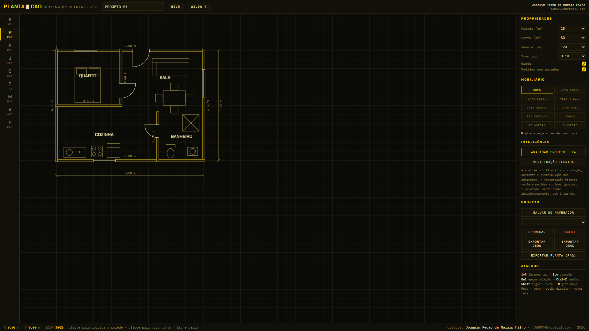
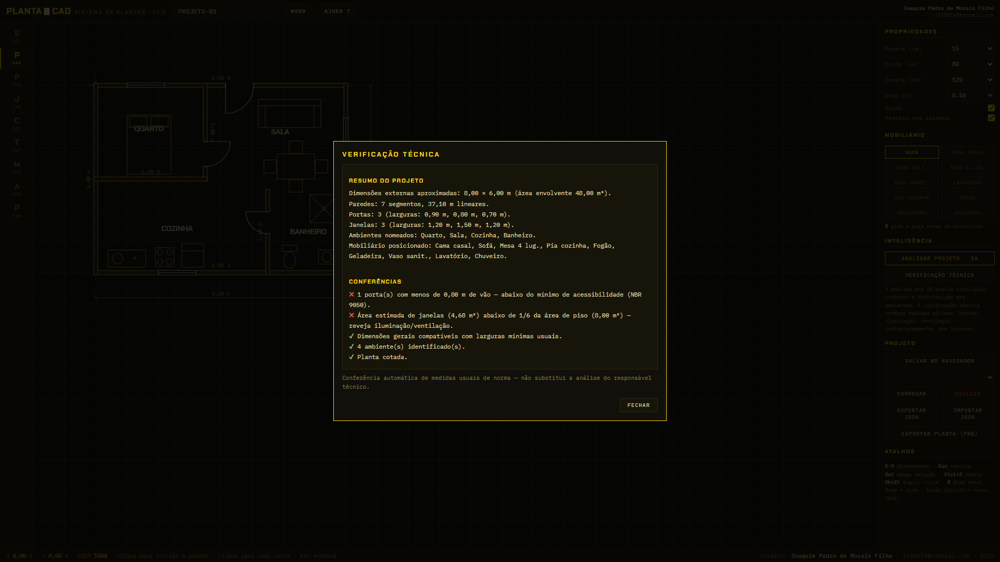
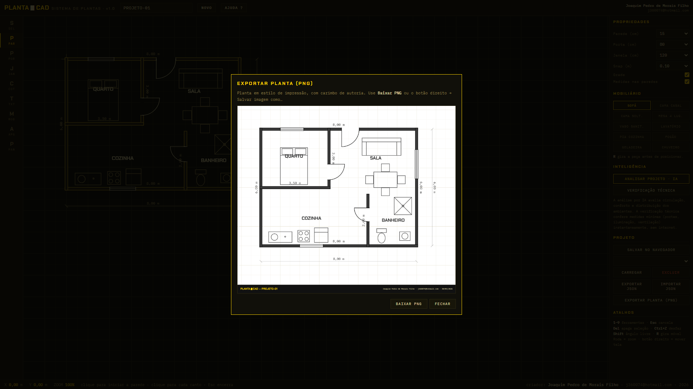

# PlantaCAD

**Sistema de criação de plantas baixas para arquitetos, direto no navegador.**

[](https://elevbit-ai.github.io/plantacad/)
[](LICENSE)
[](#)

O PlantaCAD desenha plantas baixas em **escala real** — paredes com espessura de obra,
portas com arco de giro, janelas em simbologia técnica, cotas em metros e mobiliário
verdadeiro — e entrega a prancha final em estilo de impressão, com carimbo de autoria.
Sem instalação, sem cadastro: um único arquivo HTML.

**Acesse:** https://elevbit-ai.github.io/plantacad/ · **Editor:** https://elevbit-ai.github.io/plantacad/app.html



## Recursos

- **Paredes em escala** — espessuras de 10 a 25 cm, desenho em cadeia com trava
  automática no esquadro (0°/45°/90°) e medida em metros sobre cada trecho.
- **Portas e janelas** — inseridas com um clique sobre a parede; a porta abre para
  o lado do cursor, com o vão descontado; janela em traço triplo. Larguras de 60 a 200 cm.
- **Cotas e textos** — cotas com traço a 45°, nomes de ambientes, grade métrica
  e snap configurável (5 a 50 cm).
- **Mobiliário real** — dez peças em escala: camas, sofá, mesa com cadeiras e os
  conjuntos completos de cozinha e banheiro.
- **Inteligência de projeto** — dois níveis:
  - *Verificação técnica* (off-line, instantânea): vão mínimo de portas (0,80 m,
    NBR 9050), iluminação/ventilação (janelas ≥ 1/6 do piso), larguras mínimas,
    identificação e cotagem.
  - *Análise por IA* (on-line): parecer profissional sobre circulação, conforto e
    melhorias, gerado a partir das medidas reais do desenho via serviço público
    gratuito ([Puter.js](https://puter.com) — sem chave de API; login gratuito no
    primeiro uso).
- **Salvamento completo** — projetos nomeados no navegador (localStorage),
  exportação/importação **JSON** e prancha final em **PNG** estilo impressão,
  com carimbo de autoria e data.
- **Desfazer ilimitado**, zoom, pan e atalhos de teclado (1–9 para ferramentas,
  Ctrl+Z, Del, R para girar mobiliário, Shift para ângulo livre).

## Demonstração

Vídeo explicativo em português (3 min): [media/demo.mp4](media/demo.mp4) —
também incorporado no [site do projeto](https://elevbit-ai.github.io/plantacad/#video).

| Verificação técnica | Prancha exportada |
|---|---|
|  |  |

## Como usar

1. Abra o [editor](https://elevbit-ai.github.io/plantacad/app.html) — ou baixe
   `app.html` e abra localmente (tudo funciona off-line, exceto a análise por IA).
2. **PAR**: um clique por canto para levantar as paredes (`Esc` encerra a sequência).
3. **POR / JAN**: clique sobre uma parede para inserir portas e janelas.
4. **COT / TXT / MOB**: cote, nomeie os ambientes e posicione o mobiliário.
5. **Inteligência**: rode a verificação técnica e a análise por IA.
6. **Projeto**: salve no navegador, exporte JSON ou gere a prancha PNG.

## Estrutura

```
plantacad/
├── index.html      # site do projeto
├── app.html        # o editor completo (arquivo único, sem dependências)
├── assets/         # capturas de tela
└── media/demo.mp4  # vídeo de demonstração narrado em português
```

## Licença

Distribuído sob a licença [MIT](LICENSE). Uso livre, inclusive comercial,
mantendo o aviso de copyright.

## Autor

**Joaquim Pedro de Morais Filho**
📧 j360074@hotmail.com

*A verificação técnica confere medidas usuais de norma de forma automática e não
substitui a análise do responsável técnico pelo projeto.*
